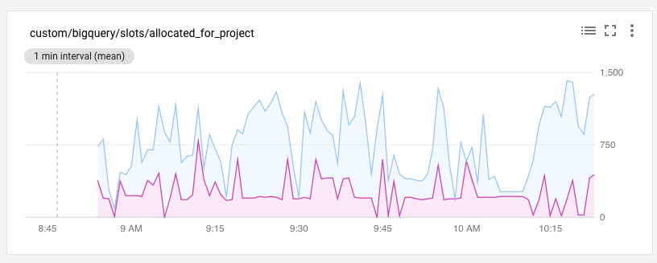

# BigQuery cross-project slots utilization monitoring

This solution was written to help monitoring slot utilization across multiple projects, while breaking down allocation per project. This is relevant for customers using [flat-rate pricing](https://cloud.google.com/bigquery/pricing#flat_rate_pricing).

## Background

As of time of writing, BigQuery slots can be reserved as part of [flat-rate pricing](https://cloud.google.com/bigquery/pricing#flat_rate_pricing). This is defined on a billing account ID. All projects using the billing account ID get access to the pool of reserved slots.

This raises to need to monitor:
1. How many of the slots are allocate.
2. Per-project allocation breakdown (e.g: finding which projects are consuming majority of slots at a given time).

## Challenges

Stackdriver, GCP's provided monitoring tool, [provides a metric](https://cloud.google.com/monitoring/api/metrics_gcp#gcp-bigquery) to monitor allocation across a reservation (slots/total_allocated_for_reservation). This works with a couple of caveats:
- Monitoring must be done on a project with BigQuery activity.
- This doesn't solve this for hierarchical slot reservations.
- This doesn't show a per-project slots allocation breakdown.

It is possible to monitor per-project slots allocation breakdown by linking all projects to the same Stackdriver account and creating a chart to solve the task. However, this presents the following challenges, as time of writing:
- Linking projects to Stackdriver accounts is not possible programmatically.
- Overhead making sure list of projects is up-to-date with projects using the billing account ID in hand.
- Stackdriver supports link up to 100 projects to a single Stackdriver account. While sufficient for some configurations, this might not be scalable for others.

## About the solution

The application is using the following GCP products / services:
- AppEngine Standard (Python 2.7 runtime)
- Cloud Tasks
- Datastore
- Billing API
- Stackdriver (Monitoring API)

The challenge is solved as follows:
- Billing API is used to dynamically and automatically discover projects using the billing account ID in hand.
- Monitoring API is used to create a custom metric in a defined central Stackdriver account.
- Monitoring API is used to read metrics from all linked projects, and write to the custom metric created in the central Stackdriver account. This removes the need of linking all projects to a Stackdriver.
- Datastore is used to record last fetched data point from each project. This is needed to only read latest data from each project.

The metric collected from all projects is: bigquery.googleapis.com/slots/allocated_for_project.
The custom metric created in the central Stackdriver account is: custom.googleapis.com/bigquery/slots/allocated_for_project

The below is a screenshot of a stacked area chart created in Stackdriver based on this solution. In this stacked area chart, we can see the total slot allocation, broken down by project.

## Setting up

1. [Install third-party library](https://cloud.google.com/appengine/docs/standard/python/tools/using-libraries-python-27) required by the application: pip install -t lib/ requirements.txt
2. Modify configuration files
- Modify config.py to include billing account ID, and project ID where Stackdriver is created.
- You may want to change scaling settings in app.yaml. The version in the repository defines a maximum instance count of 3 to help controlling costs.
- Metrics are collected every 5 minutes. Change cron.yaml accordingly to modify this if needed.
3. (Enable Cloud Billing API)[https://support.google.com/cloud/answer/6158841?hl=en]: API & Services -> Cloud Billing API -> Enable
4. Deploy AppEngine application: gcloud app deploy *.yaml -v <version>
5. Grant Default AppEngine Service account with the required permissions:
- Billing Viewer on Billing Account ID ([documentation](https://cloud.google.com/billing/docs/how-to/billing-access#update_billing_permissions))
- Monitoring Editor on project hosting Stackdriver account
- Monitoring Viewer on all projects. It will be easier to apply this on Folder / Org level.
6. Metrics will be collected every 5 minutes, and should appear shortly in Stackdriver as custom.googleapis.com/bigquery/slots/allocated_for_project. You may want to create a stacked chart to show allocation broken down by projects on a single chart.
