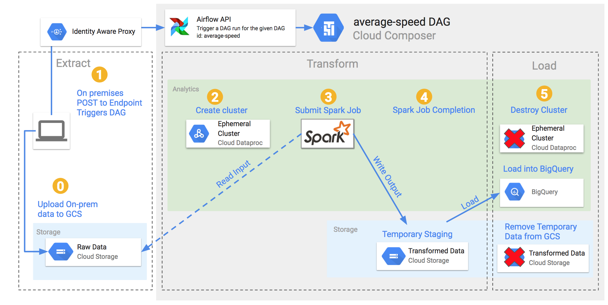
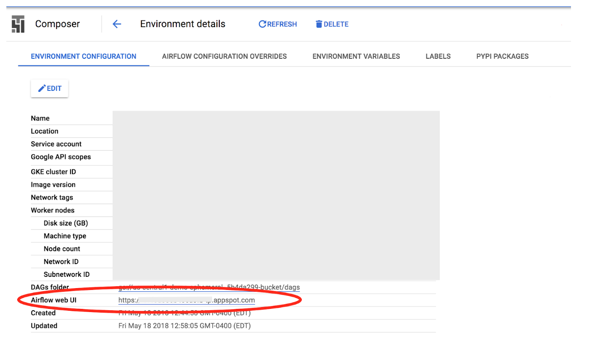

## Cloud Composer: Ephemeral Dataproc Cluster for Spark Job
### Workflow Overview 

***




An HTTP POST to the airflow endpoint from an on-prem system is used as a trigger to initiate the workflow.

At a high level the Cloud Composer workflow performs the following steps:
1. Extracts some metadata from the HTTP POST that triggered the workflow. 
2. Spins up a Dataproc Cluster. 
3. Submits a Spark job that performs the following:

-Reads newline delimited json data generated by an export from the [nyc-tlc:yellow.trips public 
     BigQuery table](https://bigquery.cloud.google.com/table/nyc-tlc:yellow.trips?pli=1).  
- Enhances the data with an average_speed column.
- Writes the enhanced data as in CSV format to a temporary location in Google Cloud storage.
3. Tear down the Dataproc Cluster Load these files to BigQuery.
4. Clean up the temporary path of enhanced data in GCS.

##### 1. Extract metadata from POST:
When there is an HTTP POST to the airflow endpoint it should contain a paylaod of the following structure.
```
    payload = {
        'run_id': 'post-triggered-run-%s' % datetime.now().strftime('%Y%m%d%H%M%s'),
        'conf':  "{'raw_path': raw_path, 'transformed_path': transformed_path}"
        
    }
```
Where raw_path is a timestamped path to the existing raw files in gcs in newline delimited json format and 
transformed path is a path with matching time stamp to stage the enhanced file before loading to BigQuery.


##### 2 & 3. Spins up a Dataproc Cluster and submit Spark Job

The workflow then provisions a Dataproc Cluster and submits a spark job to enhance the data.

##### 4. Move to processed bucket

Based on the status of the Spark job, the workflow will then move the processed files to a Cloud Storage bucket setup to store processed data. A separate folder is created along with a processed date field to hold the files in this bucket.

##### Full code examples

Ready to dive deeper? Check out the [complete code](composer_http_post_examples/ephemeral_dataproc_spark_dag.py)

***

#### Setup and Pre-requisites
It is recommended that virtualenv be used to keep everything tidy. The [requirements.txt](requirements.txt) describes the dependencies needed for the code used in this repo.
```bash
virtualenv composer-env
source composer-env/bin/activate
```
The POST will need to be authenticated with [Identity Aware Proxy](https://cloud.google.com/iap/docs/).
We reccomend doing this by copying the latest version of [make_iap_request.py](https://github.com/GoogleCloudPlatform/python-docs-samples/blob/master/iap/make_iap_request.py) 
from the Google Cloud python-docs-samples repo and using the provided [dag_trigger.py](dag_trigger.py).
```bash
pip install -r ~/professional-services/data-analytics/cloud-composer-examples/requirements.txt
wget https://raw.githubusercontent.com/GoogleCloudPlatform/python-docs-samples/master/iap/requirements.txt -O ~/professional-services/data-analytics/cloud-composer-examples/iap_requirements.txt
pip install -r iap-requirements.txt
wget https://raw.githubusercontent.com/GoogleCloudPlatform/python-docs-samples/master/iap/make_iap_request.py -O ~/professional-services/data-analytics/cloud-composer-examples/cloud_composer_example/composer_http_post_example/make_iap_request.py
```
(Or if your are on a Mac you can use curl.)
```bash
# From the cloud-composer-examples directory
pip install -r ~/professional-services/data-analytics/cloud-composer-examples/requirements.txt
curl https://raw.githubusercontent.com/GoogleCloudPlatform/python-docs-samples/master/iap/requirements.txt >> ~/professional-services/data-analytics/cloud-composer-examples/iap_requirements.txt
pip install -r iap-requirements.txt
curl https://raw.githubusercontent.com/GoogleCloudPlatform/python-docs-samples/master/iap/make_iap_request.py >> ~/professional-services/data-analytics/cloud-composer-examples/cloud_composer_example/composer_http_post_example/make_iap_request.py
```

Note that we skipped install pyspark for the purposes of being lighter weight to stand up this example. If you have the need to test pyspark locally you should additionally run:
```bash
pip install pyspark>=2.3.1
```

The following high-level steps describe the setup needed to run this example:
0. set your project information.
```bash
export PROJECT=<REPLACE-THIS-WITH-YOUR-PROJECT-ID>
gcloud config set project $PROJECT
```
1. Create a Cloud Storage (GCS) bucket for receiving input files (*input-gcs-bucket*).
```bash
gsutil mb -c regional -l us-central1 gs://$PROJECT
```
2. Export the public BigQuery Table to a new dataset.
```bash
bq mk ComposerDemo
export EXPORT_TS=`date "+%Y-%m-%dT%H%M%S"`&& bq extract \
--destination_format=NEWLINE_DELIMITED_JSON \
nyc-tlc:yellow.trips \
gs://$PROJECT/cloud-composer-lab/new-$EXPORT_TS/nyc-tlc-yellow-*.json
```
3. Create a Cloud Composer environment - Follow [these](https://cloud.google.com/composer/docs/quickstart) steps to create a Cloud Composer environment if needed (*cloud-composer-env*).
We will set these variables in the composer environment.

| Key                   | Value                                           |Example                                   |
| :--------------------- |:---------------------------------------------- |:---------------------------              |
| gcp_project           | *your-gcp-project-id*                           |cloud-comp-http-demo                        |
| gcp_bucket            | *gcs-bucket-with-raw-files*                     |gs://cloud-composer-lab/new-2018          |
| gce_zone              | *compute-engine-zone*                           |us-central1b                              |

```bash
gcloud beta composer environments create demo-ephemeral-dataproc \
    --location us-central1 \
    --zone us-central1-b \
    --machine-type n1-standard-2 \
    --disk-size 20 

# Set Airflow Variables in the Composer Environment we just created.
gcloud composer environments run \
demo-ephemeral-dataproc1 \
--location=us-central1 variables -- \
--set gcp_project $PROJECT
gcloud composer environments run demo-ephemeral-dataproc1 \
--location=us-central1 variables -- \
--set gce_zone us-central1-b
gcloud composer environments run demo-ephemeral-dataproc1 \
--location=us-central1 variables -- \
--set gcs_bucket $PROJECT
gcloud composer environments run demo-ephemeral-dataproc1 \
--location=us-central1 variables -- \
--set bq_output_table $PROJECT:ComposerDemo.nyc-tlc-yellow-trips
```

6. Browse to the Cloud Composer widget in Cloud Console and click on the DAG folder icon as shown below:


7. Upload the PySpark code [spark_avg_speed.py](composer_http_examples/spark_avg_speed.py) into a *spark-jobs* folder in GCS.
```bash
gsutil cp ~/professional-services/data-analytics/cloud-composer-example/cloud_composer_example/spark_avg_speed.py gs://$PROJECT/spark-jobs/
``` 

8. The DAG folder is essentially a Cloud Storage bucket. Upload the [ephemeral_dataproc_spark_dag.py](composer_http_examples/ephemeral_dataproc_spark_dag.py) file into the folder:

```bash
gsutil cp ~/professional-services/data-analytics/cloud-composer-example/cloud_composer_example/ephemeral_dataproc_spark_dag.py gs://<dag-folder>/dags
```
***

##### Triggering the workflow

Make sure that you have installed the `iap_requirements.txt` in the steps above.
You will need to create a service account with the necessary permissions to create an IAP request and use Cloud Composer to use the `dag_trigger.py` script. This can be achieved with the following commands:
```bash
gcloud iam service-accounts create dag-trigger

# Give service account permissions to create tokens for 
# iap requests.
gcloud projects add-iam-policy-binding $PROJECT \
--member \
serviceAccount:dag-trigger@$PROJECT.iam.gserviceaccount.com \
--role roles/iam.serviceAccountTokenCreator

gcloud projects add-iam-policy-binding $PROJECT \
--member \
serviceAccount:dag-trigger@$PROJECT.iam.gserviceaccount.com \
--role roles/iam.serviceAccountActor

# Service account also needs to be authorized to use Composer.
gcloud projects add-iam-policy-binding $PROJECT \
--member \
serviceAccount:dag-trigger@$PROJECT.iam.gserviceaccount.com \
--role roles/composer.user

# We need a service account key to trigger the dag.
gcloud iam service-accounts keys create ~/$PROJECT-dag-trigger-key.json \
--iam-account=dag-trigger@$PROJECT.iam.gserviceaccount.com

# Finally use this as your application credentials by setting the environment variable on the machine you will run `dag_trigger.py`
export GOOGLE_APPLICATION_CREDENTIALS=~/$PROJECT-dag-trigger-key.json
```
To trigger this workflow use [dag_trigger.py](dag_trigger.py) takes 3 arguments as shown below
```bash
python dag_trigger.py \
--url=<airflow endpoint url> \
--iapClientId=<client id> \
--raw_path=<path to raw files for enhancement in GCS>
```
The endpoint of triggering the dag had the following structure `https://<airflow web server url>/api/experimental/dags/<dag-id>/dag_runs` in this case our dag-id is average-speed.
The airflow webserver can be found once your composer environment is set up by clicking on your environment in the console and checking here:



In oder to obtain your `--iapClientId` 
Visit the Airflow URL https://YOUR_UNIQUE_ID.appspot.com (which you noted in the last step) in an incognito window, *don't* authenticate or login, and first landing page for IAP Auth has client Id in the url in the address bar: 
https://accounts.google.com/signin/oauth/identifier?**client_id=00000000000-xxxx0x0xx0xx00xxxx0x00xxx0xxxxx.apps.googleusercontent.com**&as=a6VGEPwFpCL1qIwusi49IQ&destination=https%3A%2F%2Fh0b798498b93687a6-tp.appspot.com&approval_state=!ChRKSmd1TVc1VlQzMDB3MHI2UGI4SxIfWXhaRjJLcWdwcndRVUU3MWpGWk5XazFEbUp6N05SWQ%E2%88%99AB8iHBUAAAAAWvsaqTGCmRazWx9NqQtnYVOllz0r2x_i&xsrfsig=AHgIfE_o0kxXt6N3ch1JH4Fb19CB7wdbMg&flowName=GeneralOAuthFlow

***
