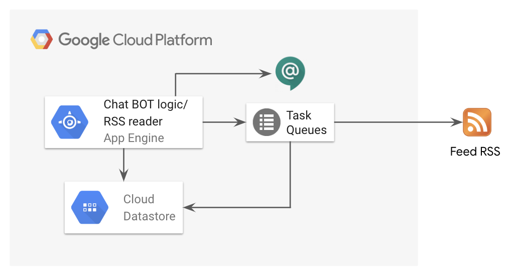

# GCP Release Notes Updater BOT

This solution was built with the purpose of demonstrating how to develop a fully serverless
Hangouts Chat BOT. The purpose of the solution is to daily update Release Notes of selected GCP products
and notify users in case of news. This document will guide you through the necessary steps to set up
the entire solution on Google Cloud Platform (GCP).

## Architecture

The image below contains a high level diagram of the solution.

Main features:
* daily synchronization of all registered feeds
* ability to manually query the BOT for getting latest release notes about a specific solution (e.g. bigquery)
* automatic message push in registered rooms
  * one dedicated thread per solution
  * all subsequents solution updates displayed on the same thread

## Prerequisites

* G Suite domain where to connect the Hangouts Chat
* GCP project where to deploy the application referenced with
  * **[PROJECT_ID]**
  * **[PROJECT_NUMBER]**
* Enabled [Google Hangouts Chat API](https://console.cloud.google.com/apis/library/chat.googleapis.com) in the selected GCP project
* A newly generated [UUID](https://www.uuidgenerator.net/) code referenced with
  * **[BOT_UUID]**
* Configuration completed for the [Google Hangouts Chat API](https://console.cloud.google.com/apis/library/chat.googleapis.com) 
  * _Bot Name_ : the name of the BOT that will appear on Hangouts Chat
  * _Avatar URL_: the url of the BOT avatar
  * _Description_: a desciption of the BOT
  * Enable both "_Bot works in direct messages_" and "_Bot works in rooms_" flags
  * _Connections String_: select "Bot URL"
  * _Bot URL_: https://[PROJECT_ID].appspot.com/rest/chat/bot/listen/[BOT_UUID]
  * _Permissions_ : decide what you prefer. People you will add here will have visibility of the BOT
* A _Service Account_ 
* _Service Account JSON key_ saved in the following file: `src/main/webapp/SA.json`
* Authenticated gcloud
`gcloud auth login`
* Configured gcloud
`gcloud config set project [PROJECT_ID]`
* AppEngine app in the selected GCP project
`gcloud app create`

## AppEngine Application
Before start compiling and deploying the application following elements have to be update: 

1. Modify the file `src/main/java/com/google/cloud/demo/hangouts/chat/bot/shared/JwtVerifyFilter.java` updating [YOUR_PROJECT_NUMBER] with proper value
2. Modify the file `src/main/webapp/WEB-INF/web.xml` updating [YOUR_BOT_UUID] with proper value
3. Compile the project using the command `mvn install "-Dgcp.projectid=[YOUR_PROJECT_ID]"`

Deploy all the components 
4. Deploy Queue `mvn appengine:deployQueue`
5. Deploy Cron `mvn appengine:deployCron`
6. Deploy he application using following command `mvn appengine:deploy`

Initial load
7. Load this URL in the browser `https://[YOUR_PROJECT_ID].appspot.com/rest/feed/initial-load` and wait for the feedback
8. Load this URL in the browser `https://[YOUR_PROJECT_ID].appspot.com/rest/cron/feed/update` and wait for the feedback

## Testing

Direct interaction with the BOT
1. Open Hangouts Chat
2. Search for the BOT "GCP Release Notes Updater"
3. Send  `help` message to get immediate feedback and start playing with it

Room interaction
1. Open Hangouts Chat
2. Create a room
3. Add the BOT into the room
4. Wait some seconds to receive one message for registered GCP solutions (44 threads will be created)
5. The application will automatically send updates to single thread in case of solution news 
