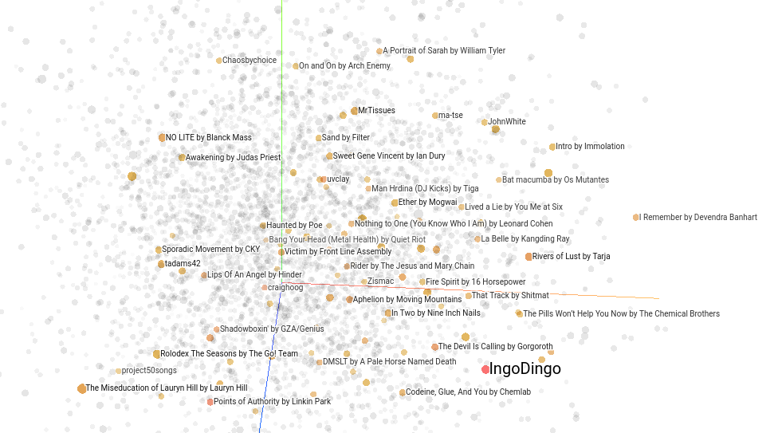

# CloudML Deep Collaborative Filtering
A simple machine learning system capable of recommending songs given a user as a query
using collaborative filtering and TensorFlow.

Unlike classic matrix factorization approaches, using a neural network allows
user and item features to be included during training. 

This example covers how distributed data preprocessing, training, and serving
can be done on [Google Cloud Platform](https://cloud.google.com/)(GCP).

Further reading:
  - [Neural Collaborative Filtering](https://arxiv.org/abs/1708.05031): A paper
    on using neural networks instead of matrix factorization to perform
    collaborative filtering.
  - [Deep Neural Networks for YouTube Recommendations](https://ai.google/research/pubs/pub45530):
    Youtube's approach to recommending millions of videos at low latencies by
    first generating candidates from multiple models and ranking the candidate
    pool.

For a fully managed service, check out [Recommendations
AI](https://cloud.google.com/recommendations/).

## Setup
Create a new project on GCP and set up GCP credentials.
```shell
gcloud auth login
gcloud auth application-default login
```

Set up your python environment
```shell
virtualenv venv --python=/usr/bin/python2.7
source ./venv/bin/activate
pip install -r requirements.txt
```

## Preprocessing
The data preprocessing pipeline uses the
[ListenBrainz](https://console.cloud.google.com/marketplace/details/metabrainz/listenbrainz)
dataset hosted on [Cloud
Marketplace](https://console.cloud.google.com/marketplace). Data is processed
and written to [Google Cloud Storage](https://cloud.google.com/storage/)(GCS) as
[TFRecords](https://www.tensorflow.org/tutorials/load_data/tf_records).

These files are read using [Cloud DataFlow](https://cloud.google.com/dataflow/).
The steps involved are as follows:
1. Read the data in using the
   [BigQuery](https://cloud.google.com/bigquery/) query found
   [here](trainer/query.py).
   This query cleans the features and creates a `count_norm` label which is the
   number of times a user has played to a particular song divided by the most
   times they've played any song. It also calculates `top_10`, the 10 most
   popular songs for each user to use in evaluation.
2. Using [TensorFlow
   Transform](https://www.tensorflow.org/tfx/transform/get_started), map each
   username and product id to an integer value and write the vocabularies to
   text files. Leave users and items under a set frequency threshold out of the
   vocabularies.
3. Filter away user-item pairs where either element is outside of its
   cooresponding vocabulary.
4. Split the data into train, evaluation, and test sets.
5. Write each dataset as TFRecords to GCS.

### Execution
| Command | Description |
|---------|-------------|
| `bin/run.preprocess.local.sh` | Process a sample of the data locally and write outputs to a local directory. |
| `bin/run.preprocess.cloud.sh` | Process the data on GCP using DataFlow and write outputs to a GCS bucket. |


## Training
A [Custom Estimator](https://www.tensorflow.org/guide/custom_estimators) is
trained using TensorFlow and [Cloud AI Platform](https://cloud.google.com/ai-platform/)(CAIP).
The trainng steps are as follows:
1. Read TFRecords from GCS and create a `tf.data.Dataset` for each of them that
   yields data in batches.
2. Use the TensorFlow Transform output from preprocessing to transform usernames
   and product ids into int ids.
3. Use `user_id`s and `item_id`s to train embeddings.
4. Add item features and create two input layers: one with user embedding
   vectors, and another with the concatenation of item embedding vectors and
   item features.
5. Create a user neural net and item neural net from the input layers, ensuring
   that the final layers are the same size.
6. Compute the cosine similarity between the final layers of the user and item
   nets. Feed the similarity through the sigmoid function to get a value between
   0 and 1.
7. Calculate error using RMSE and train the model.
8. Evaluate the model performance by, for each review, finding the `k` most
   similar items for the user and using the predictions to compute recall.
9. Export a `SavedModel` for use in serving.

### Execution
Training job scripts expect the following argument:
- `MODEL_INPUTS_DIR`: The directory containing the TFRecords from preprocessing.

| Command | Description |
|---------|-------------|
| `bin/run.train.local.sh` | Train the model locally and save model checkpoints to a local model dir. |
| `bin/run.train.cloud.sh` | Train the model on CAIP and save model checkpoints to a GCS bucket. |
| `bin/run.train.tune.sh` | Train the model on CAIP as above, but using hyperparameter tuning. |

Note: `SCALE_TIER` is set to `STANDARD_1` to demonstrate distributed training.
However, it can be set to `BASIC` to reduce costs. See [scale
tiers](https://cloud.google.com/ml-engine/docs/tensorflow/machine-types).

### Tensorboard
Model training can be monitored on Tensorboard using the following command:
```shell
tensorboard --logdir <path to model dir>/<trial number>
```
Tensorboard's projector, in particular, is very useful for debugging
or analyzing embeddings.



## Serving
Models can be hosted on CAIP, which can be used to make online and batch predictions via JSON requests.
1. Upload the `SavedModel` from training to CAIP.
2. Using a file containing a list of usernames, create inputs to pass to the
   model hosted on CAIP for predictions.
3. Make the predictions.

### Execution
The cloud serving job and prediction job scripts expect the same argument:
- `MODEL_OUTPUTS_DIR`: The model directory containing each model trial.
- `TRIAL` (optional): The trial number to use.
The local serving job expects no arguments, and the local prediction job expects
the model version number.

| Command | Description |
|---------|-------------|
| `bin/run.serve.local.sh` | Upload a new version of the recommender model to CAIP using a locally trained model. |
| `bin/run.serve.cloud.sh` | Upload a new version of the recommender model to CAIP using a model trained on CAIP. |
| `bin/run.predict.local.sh` | Using `serving/test.json`, create a prediction job on CAIP after using the local serving script. |
| `bin/run.predict.cloud.sh` | Using `serving/test.json`, create a prediction job on CAIP after using the cloud sering script. |
