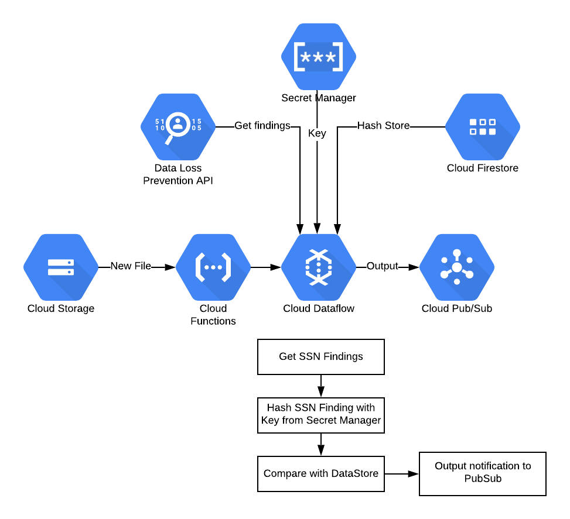

# Hashpipeline

## Overview

In this solution, we are trying to create a way to indicate security teams if there is a file found with US
Social Security Numbers (SSNs). While the DLP API in GCP offers the ability to look for SSNs, it may not be
accurate, especially if there are other items such as account numbers that look similar. One solution would
be to store SSNs in a Dictionary InfoType in Cloud DLP, however that has the following limitations:

* Only 5 Million total records
* SSNs stored in plain text

To avoid those limitations, we are going to create a PoC Dataflow pipeline that will run for every new file
in a specified GCS bucket and determine how many (if any) SSNs are found, triggering a Pubsub Topic. The known
SSNs will be stored in Firestore, a highly scalable key value store, only after being hashed with a salt and
key, which is stored in Secret Manager. This is what the architecuture will look like when we're done.



## Usage

This repo offers end-to-end deployment of the hashpipeline solution using [HashiCorp Terraform](https://terraform.io)
given a project id.

### Prerequisites

This has only been tested on Mac OSX but will likely work on Linux as well.

* `terraform` executable is available in `$PATH`
* `gcloud` is installed and up to date
* `python` is version 3.7 or higher


### Step 1: Deploy the Infrastructure

```
cd infrastructure
TF_VAR_project=<PROJECT_ID> terraform apply
```

### Step 2: Generate the Hash Key

This will create a new 64 byte key for use with BLAKE2b and store it in Secret Manager
```
make create_key
```

### Step 3: Seed the Firestore with Fake SSNs

This script will do the following:

* Create a list of valid and random Social Security Numbers
* Store the plain text in `scripts/socials.txt`
* Hash the numbers (without dashes) using BLAKE2b and the key from step 2
* Store the hashed values in Firestore under the collection specified in the terraform variable: `firestore_collection`

```
make seed_firestore
```

### Step 4: Generate some input files for dataflow to use

This will store the input files under the `inputs/` directory, so we have something to test with.

```
make generate_input_files
```

### Step 5: Test out the pipeline locally

This will run the pipeline against the `small-input.txt` file generated by the previous step. In only has
50 lines so it shouldn't take too long.

```
make run_local
```

View the job process in the Google Cloud console under [Dataflow Jobs](https://console.cloud.google.com/dataflow).
Once the job has completed successfully, you can verify that the Pubsub topic has written by navigating to [Pubsub
Subscriptions](https://console.cloud.google.com/cloudpubsub/subscription/list) and clicking on the subscription we
created in terraform. If you subsequently click on `View Messages` and `Pull` you should see a new message that looks
something like this (though the number, bucket and filename will be different for you):

```
Found 23 SSNs in gs://rcanty-dataflow-test/small.txt
```

This number can be verified by looking in the file itself on the first line, which should say `expected_valid_socials = 23`
for this example

### Step 6: Deploy the pipeline to a template so our Cloud Function can run it

```
make deploy
```

### Step 7: Test it out

There should now be a bucket for your testing that the Cloud Function is connected to if you ran the terraform.
By default, this bucket is `gs://<PROJECT_ID>-test` unless you overrode it. Let's upload the larger input file
of 10,000 lines into the bucket. The Cloud Function should respond by triggering the Dataflow job.

Just like Step 5, you can view your job's progress and then pull the message. This time you should see a much larger
number.

## Disclaimer

While best efforts have been made to make this pipeline hardened from a security perspective, this is meant **only as
a demo and proof of concept** and should not be directly used in a production system without being fully vetted by security
teams and the people who will maintain the code in the organization.
