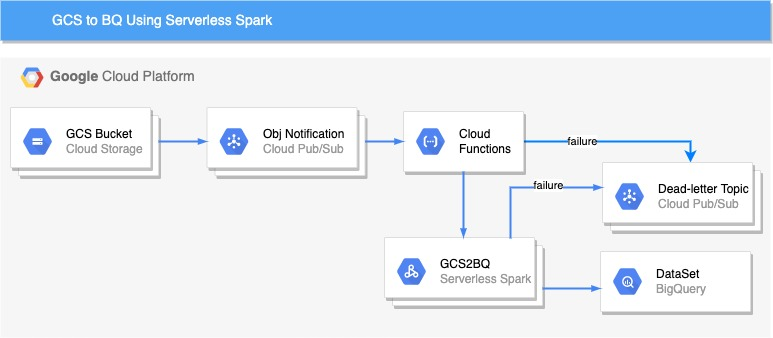

# Ingesting GCS files to BigQuery using Cloud Functions and Serverless Spark

In this solution, we build an approch to ingestion flat files (in GCS) to BigQuery using serverless technology. We use [Daily Shelter Occupancy](https://open.toronto.ca/dataset/daily-shelter-occupancy/) data in this example. Figure below shows an overall approach. Once the object is uploaded in the GCS bucket, a object notification is recevied by the Pub/Sub Topic. Pub/Sub Topic triggers a cloud function which then invokes the serverless spark. Any error during the cloud function invocation and serverless spark execution is send to dead letter topic.




- **Step 1:**  Create a bucket, the bucket holds the data to be ingested in GCP. Once the object is upload in a bucket, the notification is created in Pub/Sub topic.

    ```
    PROJECT_ID=<<project_id>>
    GCS_BUCKET_NAME=<<Bucket name>>
    gsutil mb gs://${GCS_BUCKET_NAME}
    gsutil notification create \
        -t projects/${PROJECT_ID}/topics/create_notification_${GCS_BUCKET_NAME} \
        -e OBJECT_FINALIZE \
        -f json gs://${GCS_BUCKET_NAME}
    ```
- **Step 2:** Build and copy jar to a GCS bucket(Create a GCS bucket to store the jar if you dont have one)
  
    ```
    GCS_ARTIFACT_REPO=<<artifact repo name>>
    gsutil mb gs://${GCS_ARTIFACT_REPO}
    cd gcs2bq-spark
    mvn clean install
    gsutil cp target/GCS2BQWithSpark-1.0-SNAPSHOT.jar gs://${GCS_ARTIFACT_REPO}/
    ```

- **Step 3:** [The page](https://cloud.google.com/dataproc-serverless/docs/concepts/network) describe the network configuration required to run serverless spark
  
  - **Open subnet connectivity:** The subnet must allow subnet communication on all ports. The following gcloud command attaches a network firewall to a subnet that allows ingress communications using all protocols on all ports if the source and destination are tagged with "serverless-spark"

      ```
      gcloud compute firewall-rules create allow-internal-ingress \
      --network="default" \
      --source-tags="serverless-spark" \
      --target-tags="serverless-spark" \
      --direction="ingress" \
      --action="allow" \
      --rules="all"
      ````

  - **Private Google Access:** The subnet must have [Private Google Access](https://cloud.google.com/vpc/docs/configure-private-google-access) enabled.
      - External network access. Drivers and executors have internal IP addresses. You can set up [Cloud NAT](https://cloud.google.com/nat/docs/overview) to allow outbound traffic using internal IPs on your VPC network.

- **Step 4:** Create necessary GCP resources required by Serverless Spark
    - **Create BQ Dataset** Create a dataset to load GCS files. 
        ```
        DATASET_NAME=<<dataset_name>>
        bq --location=US mk -d \
            ${DATASET_NAME}
        ```

    -  **Create BQ table** Create a table using the schema in `schema/schema.json`
        ```
        TABLE_NAME=<<table_name>>
        bq mk --table ${PROJECT_ID}:${DATASET_NAME}.${TABLE_NAME} \
            ./schema/schema.json
        ```

    - **Create service account** Create service acccount used run the service account. We also create the permission required to read from GCS bucket, write to BigQuery table and publish error message in deadletter queue. The service account is used to run the serverless spark, so it needs dataproc worker role as well.
  
        ```
        SERVICE_ACCOUNT_ID="gcs-to-bq-sa"
        gcloud iam service-accounts create ${SERVICE_ACCOUNT_ID} \
            --description="GCS to BQ service account for Serverless Spark" \
            --display-name="GCS2BQ-SA"
        
        roles=("roles/dataproc.worker" "roles/bigquery.dataEditor" "roles/bigquery.jobUser" "roles/storage.objectViewer" "roles/pubsub.publisher")
        for role in ${roles[@]}; do
            gcloud projects add-iam-policy-binding ${PROJECT_ID} \
                --member="serviceAccount:${SERVICE_ACCOUNT_ID}@${PROJECT_ID}.iam.gserviceaccount.com" \
                --role="$role"
        done
        ```
    - **Create BQ temp Bucket** GCS to BigQuery requires a temporary bucket. Lets create a temporary bucket
        ```
        GCS_TEMP_BUCKET=<<temp_bucket>>
        gsutil mb gs://${GCS_TEMP_BUCKET}
        ```
    - **Create Deadletter Topic and Subscription** Lets create a dead letter topic and subscription

        ```
        ERROR_TOPIC=err_gcs2bq_${GCS_BUCKET_NAME}
        gcloud pubsub topics create $ERROR_TOPIC
        gcloud pubsub subscriptions create err_sub_${GCS_BUCKET_NAME}} \
        --topic=${ERROR_TOPIC}
        ```

    Once all resources are create, please change the varaibles value () in `trigger-serverless-spark-fxn/main.py` from line 25 to 29

        ```
        bq_temp_bucket = <<GCS_TEMP_BUCKET>>
        gcs_artifact_rep = <<GCS_ARTIFACT_REPO>>
        dataset= <<DATASET_NAME>>
        bq_table = <<TABLE_NAME>>
        error_topic=<<ERROR_TOPIC>>
        ```

- **Step 5:** The cloud function is triggered one the object is copies to bucket.  The cloud function triggers the Servereless spark
  
  Deploy the function.

    ```
    cd trigger-serverless-spark-fxn
    gcloud functions deploy trigger-serverless-spark-fxn --entry-point \
    invoke_sreverless_spark --runtime python37 \
    --trigger-resource ${GCS_BUCKET_NAME}_create_notification \
    --trigger-event google.pubsub.topic.publish
    ```

- **Step 6:** Invoke the end-to-end pipeline. Download [2020 Daily Center Data](https://ckan0.cf.opendata.inter.prod-toronto.ca/download_resource/800cc97f-34b3-4d4d-9bc1-6e2ce2d6f44a?format=csv) and upload to the GCS bucket(GCS_BUCKET_NAME)
  