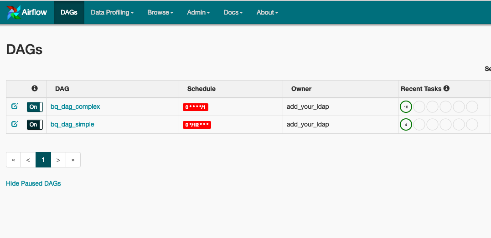
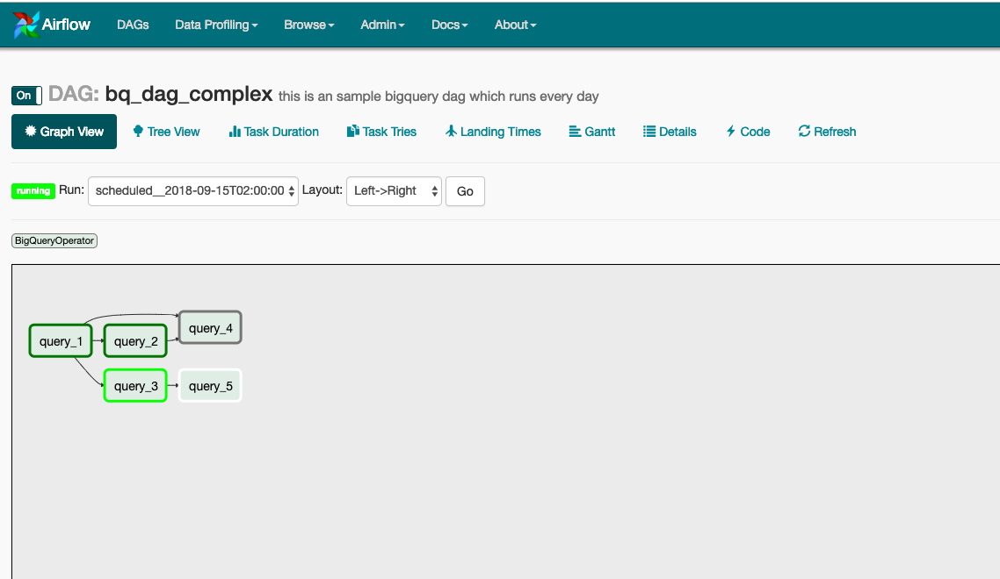

# auto-compose

*auto-compose* is a utility for dynamically generating Google cloud managed [Apache Airflow](https://cloud.google.com/composer/) DAGs from YAML configuration files. It is a fork of [*dag-factory*](https://github.com/ajbosco/dag-factory) and uses its logic to parse YAML files and convert them to airflow DAG's.

- [Installation](#installation)
- [Usage](#usage)
- [Benefits](#benefits)
- [Contributing](#contributing)
  
## Installation

To run *auto-compose* without checking out the github repository run `/bin/bash -c "$(curl -fsSL  https://raw.githubusercontent.com/suchitpuri/auto-compose/master/scripts/bootstrap.sh)"
`. It requires docker which has all the required dependencies baked in.

You can also checkout the repository and run `/bin/bash ./scripts/bootstrap.js` 

[](https://console.cloud.google.com/cloudshell/editor?cloudshell_git_repo=https%3A%2F%2Fgithub.com%2Fsuchitpuri%2Fauto-compose&cloudshell_print=cloudshell-run.txt&cloudshell_open_in_editor=bootstrap.sh)


## Usage

Once you run auto-compose, it will ask you for the following details
1. project-id : This is your GCP project id. When you run auto-compose it uses the underlying environment authentication to gcp environment. If you are not logged in go run `gcloud auth login` or similar command before running auto-compose.
2. composer-id : This is the name/id of the composer environment. You can get that from the name column of [https://console.cloud.google.com/composer/environments](https://console.cloud.google.com/composer/environments) 
3. composer-location: This is the name of the region ( e.g asia-northeast1 ) where composer is running. You can get that from the location column of [https://console.cloud.google.com/composer/environments](https://console.cloud.google.com/composer/environments)
4. YAML file absolute path: This is the absolute path of the YML file. Correct absolute path is needed so that docker mount the file 

To deploy a DAG in airflow managed by google cloud you first need to create a YAML configuration file. For example:

```
default:
  default_args:
    owner: 'default_owner'
    start_date: 2019-08-02
    email: ['test@test.com']
    email_on_failure: True
    retries: 1
    email_on_retry: True
  max_active_runs: 1
  schedule_interval: '0 * * * */1'

bq_dag_complex:
  default_args:
    owner: 'add_your_ldap'
    start_date: 2019-02-14
  description: 'this is an sample bigquery dag which runs every day'
  tasks:
    query_1:
      operator: airflow.contrib.operators.bigquery_operator.BigQueryOperator
      bql: 'SELECT count(*) FROM `bigquery-public-data.noaa_gsod.gsod2018`'
      use_legacy_sql: false
    query_2:
      operator: airflow.contrib.operators.bigquery_operator.BigQueryOperator
      bql: 'SELECT count(*) FROM `bigquery-public-data.noaa_gsod.gsod2017`'
      dependencies: [query_1]
      use_legacy_sql: false
    query_3:
      operator: airflow.contrib.operators.bigquery_operator.BigQueryOperator
      bql: 'SELECT count(*) FROM `bigquery-public-data.noaa_gsod.gsod2016`'
      dependencies: [query_1]
      use_legacy_sql: false
    query_4:
      operator: airflow.contrib.operators.bigquery_operator.BigQueryOperator
      bql: 'SELECT count(*) FROM `bigquery-public-data.noaa_gsod.gsod2015`'
      dependencies: [query_1, query_2]
      use_legacy_sql: false
    query_5:
      operator: airflow.contrib.operators.bigquery_operator.BigQueryOperator
      bql: 'SELECT count(*) FROM `bigquery-public-data.noaa_gsod.gsod2014`'
      dependencies: [query_3]
      use_legacy_sql: false

bq_dag_simple:
  default_args:
    owner: 'add_your_ldap'
    start_date: 2019-02-14
  description: 'this is an sample bigquery dag which runs every 12 hours'
  schedule_interval: '0 */12 * * *'
  tasks:
    query_1:
      operator: airflow.contrib.operators.bigquery_operator.BigQueryOperator
      bql: 'SELECT count(*) FROM `bigquery-public-data.noaa_gsod.gsod2018`'
      use_legacy_sql: false
    query_2:
      operator: airflow.contrib.operators.bigquery_operator.BigQueryOperator
      bql: 'SELECT count(*) FROM `bigquery-public-data.noaa_gsod.gsod2017`'
      dependencies: [query_1]
      use_legacy_sql: false
    query_3:
      operator: airflow.contrib.operators.bigquery_operator.BigQueryOperator
      bql: 'SELECT count(*) FROM `bigquery-public-data.noaa_gsod.gsod2016`'
      dependencies: [query_1]
      use_legacy_sql: false

```

You can see that it has all the airflow semantics, like default args, schedule interval, max active runs and more.
You can find a complete list [here](https://airflow.readthedocs.io/en/latest/code.html#airflow.models.BaseOperator).

The best part is that currently you can use any of the following operators in YAML file directly without any configuration.

* [Logging](https://airflow.readthedocs.io/en/latest/integration.html#id2)
* [GoogleCloudBaseHook](https://airflow.readthedocs.io/en/latest/integration.html#googlecloudbasehook)
* [BigQuery](https://airflow.readthedocs.io/en/latest/integration.html#bigquery)
* [Cloud Spanner](https://airflow.readthedocs.io/en/latest/integration.html#cloud-spanner)
* [Cloud SQL](https://airflow.readthedocs.io/en/latest/integration.html#cloud-sql)
* [Cloud Bigtable](https://airflow.readthedocs.io/en/latest/integration.html#cloud-bigtable)
* [Compute Engine](https://airflow.readthedocs.io/en/latest/integration.html#compute-engine)
* [Cloud Functions](https://airflow.readthedocs.io/en/latest/integration.html#cloud-functions)
* [Cloud DataFlow](https://airflow.readthedocs.io/en/latest/integration.html#cloud-dataflow)
* [Cloud DataProc](https://airflow.readthedocs.io/en/latest/integration.html#cloud-dataflow)
* [Cloud Datastore](https://airflow.readthedocs.io/en/latest/integration.html#cloud-datastore)
* [Cloud ML Engine](https://airflow.readthedocs.io/en/latest/integration.html#cloud-ml-engine)
* [Cloud Storage](https://airflow.readthedocs.io/en/latest/integration.html#cloud-storage)
* [Transfer Service](https://airflow.readthedocs.io/en/latest/integration.html#transfer-service)
* [Google Kubernetes Engine](https://airflow.readthedocs.io/en/latest/integration.html#google-kubernetes-engine)


And this DAG will be generated and ready to run in Airflow!





## Benefits

* Construct DAGs without knowing Python
* Construct DAGs without learning Airflow primitives
* Avoid duplicative code
* Use any of the available google cloud operators
* Everyone loves YAML! ;)

## Contributing

Contributions are welcome! Just submit a Pull Request or Github Issue.


