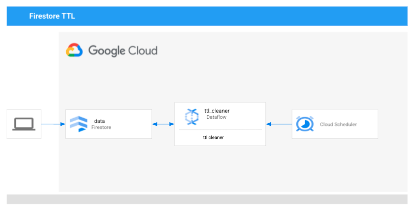

# Overview
This project helps implement a [Cloud Firestore](https://firebase.google.com/docs/firestore) [data retention](https://en.wikipedia.org/wiki/Data_retention#:~:text=The%20data%20retention%20policies%20within,the%20retention%20of%20the%20data.) policy rule based on the parameters passed to the [Cloud Dataflow](https://cloud.google.com/dataflow) batch job. This project uses a Cloud Dataflow template for running a TTL (time to live) job to delete "expired documents" in Cloud Firestore. You could run this job at a specified schedule to remove any expired document (based on data retention policy for your organization and dataset in question).

# Architecture
As shown in the following architecture it is assumed that you have a Cloud Firestore instance running and you would like to remove any document based on organization data rentention policy for a particular Firestore collection. The architecture suggests you run a dataflow template (created from this project) and pass appropriate parameter (described below) that will scan and delete all "expired" document fromt the collection.



# Compile and run

## Development environment.

The following code is used for testing purposes in local development environment.

```sh
Authorize your local with gcloud command:
gcloud auth application-default login
gcloud config set project anand-fb-test-1

To run locally: 
For using documnent snapshot create_date (internal)
python3 read.py --collection test-create-date --ttl "1 seconds"

For user defined column scan
python3 read.py --collection test-create-date --ttl "1 seconds" --ttlcolumn create_date
```
## Deploy template to test and production environment.

To run in dataflow first export variables specifying where to install the template and run it from.

- PROJECT
- REGION 
- BUCKET 


```sh
export PROJECT=<YOUR_PROJECT_ID>
export REGION=<us-east1>
export BUCKET=<YOUR_BUCKET_NAME>
```

Then you can create a template and store it in template location gs://$BUCKET/template/firestoreTTL

```sh
python3 read.py \
  --runner DataflowRunner \
  --region $REGION \
  --project $PROJECT \
  --temp_location gs://$BUCKET/tmp/ \
  --template_location gs://$BUCKET/template/firestoreTTL \
  --requirements_file requirements.txt \
  --staging_location gs://$BUCKET/staging/s1 
```
Once you created a template, you can use the following gcloud command to kick start the job or you can use the console UI also.

```sh
gcloud dataflow jobs run firestore_ttl_$(date +"%Y-%m-%d_%H:%M:%S") \
  --gcs-location gs://$BUCKET/template/firestoreTTL \
  --region $REGION \
  --parameters collection=test-create-date,ttl="2 seconds",ttlcolumn=create_date
```
## Parameters description:

The following parameter is expected by the template

| Name of parameter| Expected Values| Description |
| -----------------|----------------|-------------|
|collection | <NAME_OF_COLLECTION>| Fully qualified collection name |
| ttl | NUMBER <seconds, minutes, hour, day, month, year> | TTL value e.g. "20 seconds" , "7 years" etc.|
|ttlcolumn| <ttl_column_name> | Optional parameter: Name of column to run TTL on, if this parameter is not provided the template uses [documentSnapshot.create_time](https://firebase.google.com/docs/reference/android/com/google/firebase/firestore/DocumentSnapshot) for TTL calculation|

